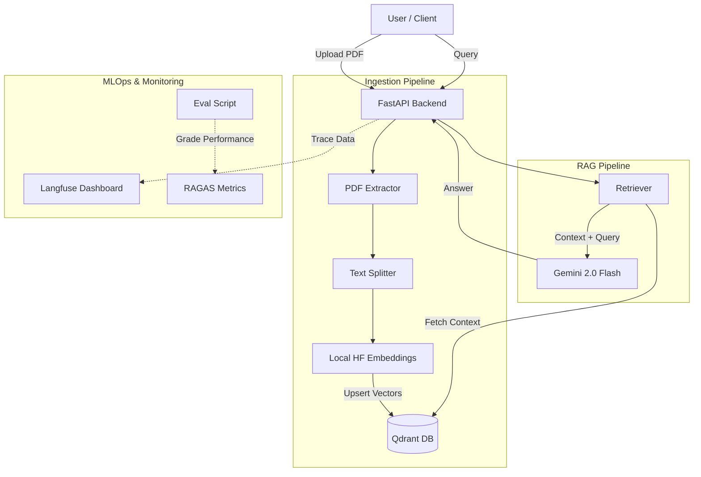

# 🚀 RAG Insight Pipeline

> **A production-ready, end-to-end RAG (Retrieval Augmented Generation) system featuring hybrid vector database storage, automated observability, evaluation pipelines, and CI/CD automation.**


## 📖 Overview

Unlike simple RAG demos, **RAG Insight Pipeline** is engineered with **MLOps best practices** in mind. It solves real-world challenges such as hallucination monitoring, rigorous evaluation, and deployment scalability.

It allows users to upload PDF documents, automatically indexes them into a vector database, and performs intelligent Q&A using Google's Gemini LLM.

### 🌟 Key Features

*   **🏗 Hybrid Vector Database Architecture**: Automatically switches between **Qdrant Local** (for development) and **Qdrant Cloud** (for production) based on environment configuration.
*   **👁️ Full Observability**: Integrated with **Langfuse** to trace every request, monitor latency, token usage, and debug retrieval steps in real-time.
*   **📉 Cost-Efficient Embedding**: Uses local **HuggingFace Embeddings** (`all-MiniLM-L6-v2`) running on CPU to avoid API rate limits and costs.
*   **🤖 Automated Evaluation**: Includes a **RAGAS** pipeline script to grade the bot's "Faithfulness" and "Relevancy" using an LLM-as-a-Judge approach.
*   **🚀 CI/CD Pipeline**: Automated testing via **GitHub Actions** ensures code quality and dependency integrity on every push.
*   **🐳 Dockerized Deployment**: Fully containerized and deployed on **Hugging Face Spaces**.

---

## 🛠 Tech Stack

| Component | Technology | Description |
| :--- | :--- | :--- |
| **Backend Framework** | **FastAPI** | High-performance async API. |
| **LLM Engine** | **Google Gemini 2.0 Flash** | Fast and efficient generation model. |
| **Embeddings** | **HuggingFace** | `sentence-transformers/all-MiniLM-L6-v2` (Local). |
| **Vector Database** | **Qdrant** | Hybrid setup (Local Disk / Cloud Cluster). |
| **Orchestration** | **LangChain** | For chaining retrieval and generation logic. |
| **Observability** | **Langfuse** | Tracing, monitoring, and debugging. |
| **Evaluation** | **RAGAS** | Automated metrics calculation. |
| **Infrastructure** | **Docker & GitHub Actions** | Containerization and CI/CD. |

---

## 🏗 Architecture



---

## 🚀 Live Demo

You can access the live Swagger UI here:
👉 **[Live Demo on Hugging Face Spaces](https://huggingface.co/spaces/bestoism/rag-insight-pipeline/docs)**

---

## ⚡ Installation & Local Setup

### 1. Clone the Repository
```bash
git clone https://github.com/bestoism/rag-insight-pipeline.git
cd rag-insight-pipeline
```

### 2. Set up Virtual Environment
```bash
python -m venv venv
# Windows
venv\Scripts\activate
# Mac/Linux
source venv/bin/activate
```

### 3. Install Dependencies
```bash
pip install -r requirements.txt
```

### 4. Configure Environment Variables
Create a `.env` file in the root directory:
```ini
# Project Settings
PROJECT_NAME="RAG Insight Pipeline"
API_V1_STR="/api/v1"

# LLM Provider (Google Gemini)
GOOGLE_API_KEY=your_google_api_key

# Vector Database (Leave URL empty for Local Mode)
# For Production: Fill URL and API KEY from Qdrant Cloud
QDRANT_URL=
QDRANT_API_KEY=

# Observability (Langfuse)
LANGFUSE_SECRET_KEY=sk-lf-...
LANGFUSE_PUBLIC_KEY=pk-lf-...
LANGFUSE_HOST=https://cloud.langfuse.com
```

### 5. Run the Application
```bash
uvicorn app.main:app --reload
```
Access the API at `http://localhost:8000/docs`.

---

## 📡 API Endpoints

### 1. Ingest Document
Uploads a PDF, chunks it, embeds it locally, and stores vectors in Qdrant.

*   **URL**: `POST /api/v1/documents/ingest`
*   **Payload**: `multipart/form-data` (File)

```bash
curl -X POST "http://localhost:8000/api/v1/documents/ingest" \
     -H "accept: application/json" \
     -H "Content-Type: multipart/form-data" \
     -F "file=@resume.pdf"
```

### 2. RAG Query
Asks a question based on the uploaded documents.

*   **URL**: `POST /api/v1/rag/query`
*   **Body**: JSON
```json
{
  "question": "What are the candidate's technical skills?"
}
```

---

## 🧪 Evaluation & Testing

### Running Unit Tests
We use `pytest` for unit testing the API health and configuration.
```bash
pytest tests/
```

### Running RAGAS Evaluation
To evaluate the RAG pipeline's accuracy (faithfulness & relevancy) against a set of test questions:
```bash
python scripts/run_eval.py
```
*Note: This script uses Gemini as a Judge to score the responses.*

---

## 🐳 Docker & Deployment

The application is containerized using Docker.

### Build Locally
```bash
docker build -t rag-pipeline .
docker run -p 7860:7860 --env-file .env rag-pipeline
```

### Deploy to Hugging Face Spaces
This project is configured to deploy automatically to Hugging Face Spaces via Docker SDK.
1. Create a Space (Docker SDK).
2. Push the code.
3. Set the variables in the Space "Settings" tab.

---

## 🤝 Contributing

Contributions are welcome! Please feel free to submit a Pull Request.

---

**Developed by [Bestoism]**
